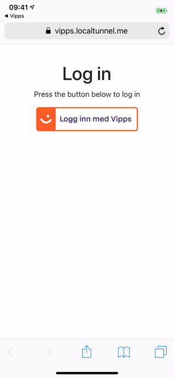

# passport-vipps

Passport strategy for [Vipps Signup/Login API](https://github.com/vippsas/vipps-signuplogin-api)

**WIP! Expect things to break! Also, Vipps is working on a new API in collboration with BankID, replacing Signup/Login. No word on when this will be available, though. Your efforts may be wasted, you have been warned!**



[See example](example/README.md)

## Install
```sh
npm install passport-vipps
```
## Usage
#### Configure strategy
This strategy authenticates users using the Vipps Signup/Login API. Upon authentication, the Vipps Signup/Login API returns an URL to a portal hosted by Vipps (Desktop) or mobile app (iOS/Android), where the user is presented with a form to either accept or reject sharing their personal details with the issuing application. Upon accept, the user is redirected back to the application.

This strategy uses sessions to keep track of users' Vipps requests and to verify authentication attempts with the Signup/Login API when the users are redirected.

```js
passport.use(new VippsStrategy({
    clientId: process.env.VIPPS_CLIENT_ID,
    clientSecret: process.env.VIPPS_CLIENT_SECRET,
    tokenKey: process.env.VIPPS_TOKEN_KEY,
    appKey: process.env.VIPPS_APP_KEY,
    merchantSerialNumber: process.env.VIPPS_MERCHANT_SERIAL_NUMBER,
    callbackUrl: 'https://vipps.localtunnel.me/auth/callback', // User redirect
    consentRemovalUrl: 'https://vipps.localtunnel.me/consentremoval', // TODO: Document this
    vippsCallback: 'http://vipps.localtunnel.me/auth/callback' // Vipps service callback TODO: Implement this
  },
  function (user, done) {
      User.findOrCreate(user)
        .then(user => {
          done(null, user)
        })
        .catch(error => {
          done(error, null)
        })
    }
));
```
#### Authenticate Requests

Use `passport.authenticate()`, specifying the `'vipps'` strategy, to
authenticate requests.

For example, as route middleware in an [Express](http://expressjs.com/)
application:

```js
app.get('/auth/login',
  passport.authenticate('vipps'));

app.get('/auth/callback',
  passport.authenticate('vipps', { failureRedirect: '/login' }),
  function(req, res) {
    // Successful authentication, redirect home.
    res.redirect('/');
  });
```
## License

[The MIT License](http://opensource.org/licenses/MIT)

Copyright (c) 2019 Torbjørn Hårstad Orskaug
